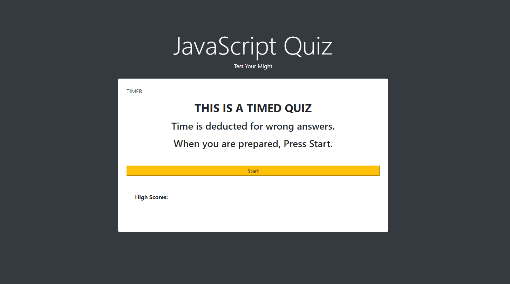
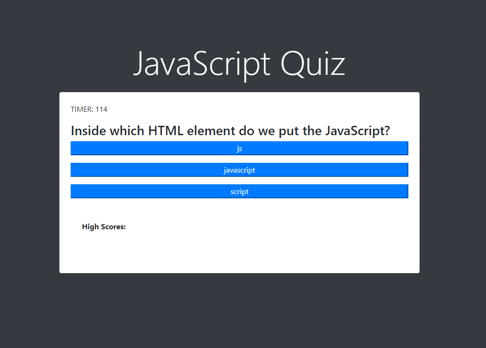
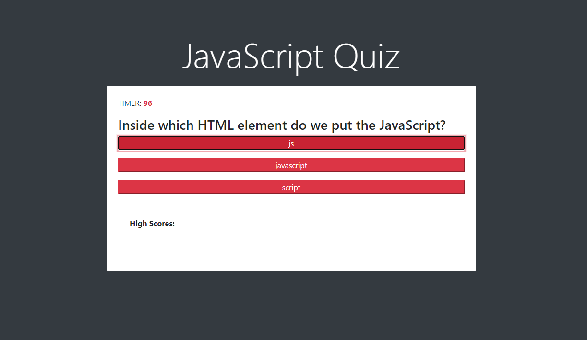
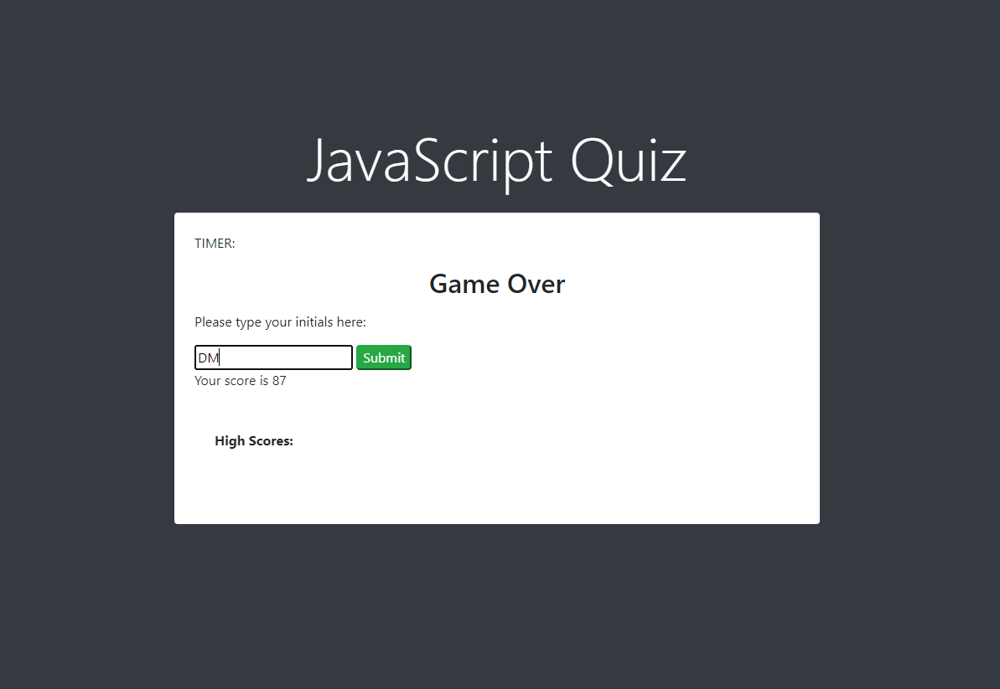
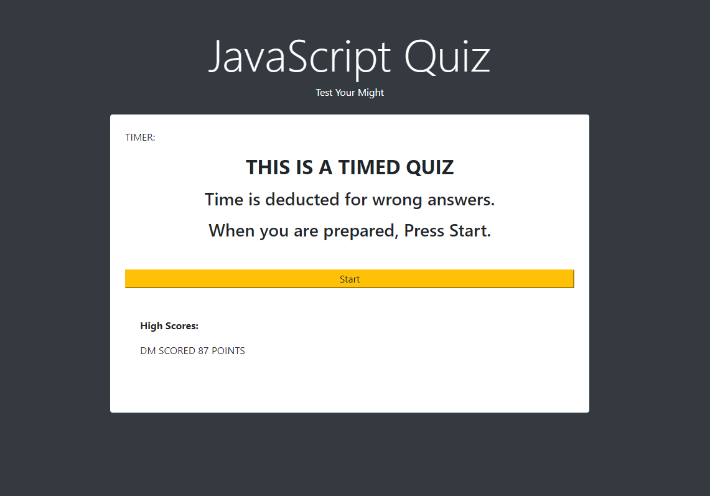

# JS_Quiz
A timed, multiple-choice quiz that shows one question at a time and reacts to user input.

Client prompt:

"AS A coding boot camp student
I WANT to take a timed quiz on JavaScript fundamentals that stores high scores
SO THAT I can gauge my progress compared to my peers

GIVEN I am taking a code quiz
WHEN I click the start button
THEN a timer starts and I am presented with a question
WHEN I answer a question
THEN I am presented with another question
WHEN I answer a question incorrectly
THEN time is subtracted from the clock
WHEN all questions are answered or the timer reaches 0
THEN the game is over
WHEN the game is over
THEN I can save my initials and score"

When the user loads the page, they are met by a start screen:

Once the user presses start, the quiz will be built onto the page:

If the user answers a question incorrectly, they receive color feedback and the timer subtracts 15 seconds:

Once the timer runs out or the test is completed, the user is presented with the game over screen:

When the user types in their initials, their score is saved to the local machine, the page reloads and their saved score is presented:

This was very challenging for me. I hope you like it.